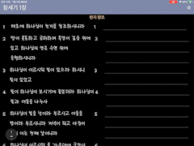

## writeBible 1.0.1

### About 
> SwiftUI로 만든 개역개정 성경필사 애플리케이션.

[📲 App store Link ](https://apps.apple.com/kr/app/%EC%83%88%EA%B8%B0%EB%8B%A4/id1633220691) 
[🖥 Demo video Youtube Link ](https://youtu.be/bkj9P1j5a2Y)

### ver 1.0.1 기능 및 특징  
> 애플펜슬로 개역개정 성경 구절을 필사할 수 있어요.  
- 필사 내용은 로컬 DB에 자동으로 저장되며, 앱 실행시 작성하던 페이지를 그대로 이어 작성할 수 있습니다. 

### 추가 예정 기능 및 개선할 점
-  ** MVVM Clean Architecture ** 로 개선해보기 
- 화면 회전 및 화면 분할 기능 
- 성경별 필사 기간 설정과 필사 분량 제시 기능
- Firebase를 통한 로그인 및 사용자 필사 데이터 저장 기능 
- 교회별 챌린지 기능 
- 도전과제 및 달성 뱃지 기능 

### 프로젝트 구조 
- 데이터 관리 : Realm Database

''' 
Application
- LaunchScreen
- AppDelegate
- SceneDelegate
- Asset
    
Managers (ViewModel)
- DrawingManager 
- RealmManager
- SettingManager 
- RecentWritingManager

View
- ColorExtension
- TitleView
- BibleView 
... 
- DrawingWrapper
- DrawingViewController
  
Model  
- Drwaing
- Bible
- RecentWrting
  
  
Font 

개역개정 -text   
''' 

